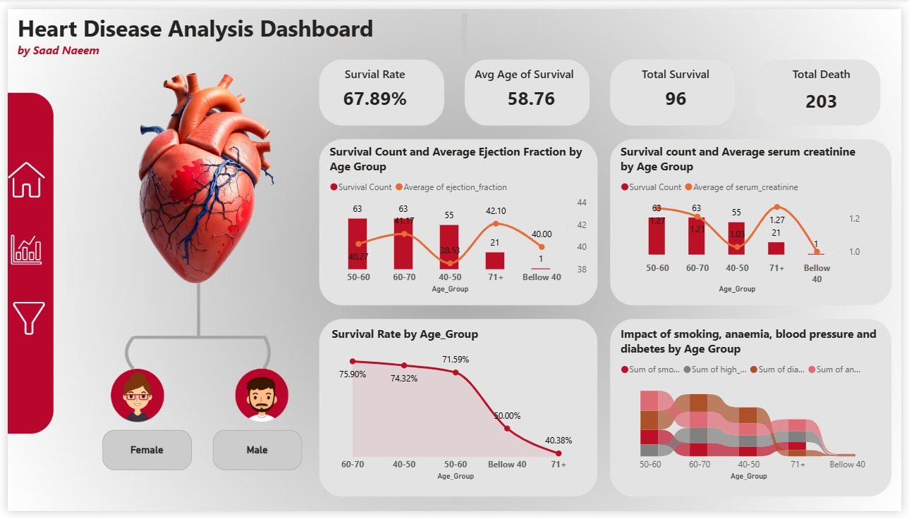

# ❤️ Heart Disease Analysis Dashboard

## 📊 Project Overview

This Power BI dashboard provides an in-depth analysis of heart disease patients, with a focus on survival trends, age-based insights, and critical health indicators such as ejection fraction and serum creatinine levels.

> 🚀 Created by **Saad Naeem**, this dashboard offers an intuitive and visually engaging way to explore patient data and uncover patterns that can assist in decision-making and health interventions.

---

## 📌 Key Insights

- **Survival Rate:** 67.89%  
- **Average Age of Survival:** 58.76  
- **Total Survivals:** 96  
- **Total Deaths:** 203  

---

## 📈 Breakdown by Age Group

### 🔹 Survival & Health Indicators
- **Ejection Fraction** & **Serum Creatinine** levels plotted by age
- Highest survival observed in age group **60–70**
- **Survival drops** significantly in age group **below 40** and **71+**

### 🔹 Survival Rate Trends
- Survival Rate:
  - 60–70: **75.90%**
  - 71+: **40.38%**

### 🔹 Comorbid Factors Tracked
- Smoking
- High Blood Pressure
- Diabetes
- Anaemia

---

## 📁 Project Files

| File/Folder | Description |
|-------------|-------------|
| `.pbix` | Power BI file with complete dashboard |
| `758b212f-22bc-4f1c-b3be-eeb16b999b2f.png` | Dashboard image preview |
| `README.md` | Project documentation |

---

## 💡 Tools Used

- **Power BI** – for dashboard creation and data visualization
- **DAX** – for custom calculations and metrics
- **Data Cleaning** – using Power Query Editor

---

## 📬 Contact

For feedback or collaboration:

📧 Email: `Saadkamyana123@gmail.com`
🌐 LinkedIn: [Your LinkedIn Profile](linkedin.com/in/saadi-naeem/)

---

> 💬 *"Data speaks louder when visualized effectively!"* — Saad Naeem

